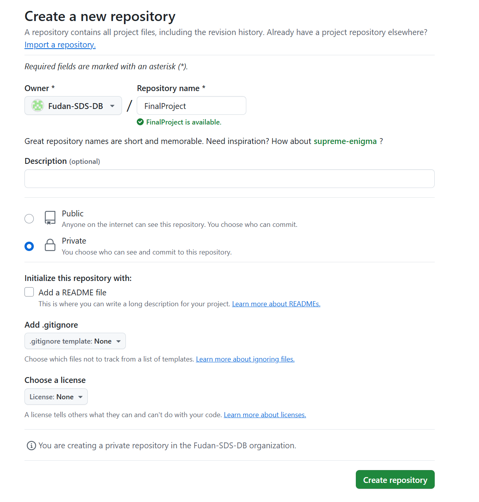
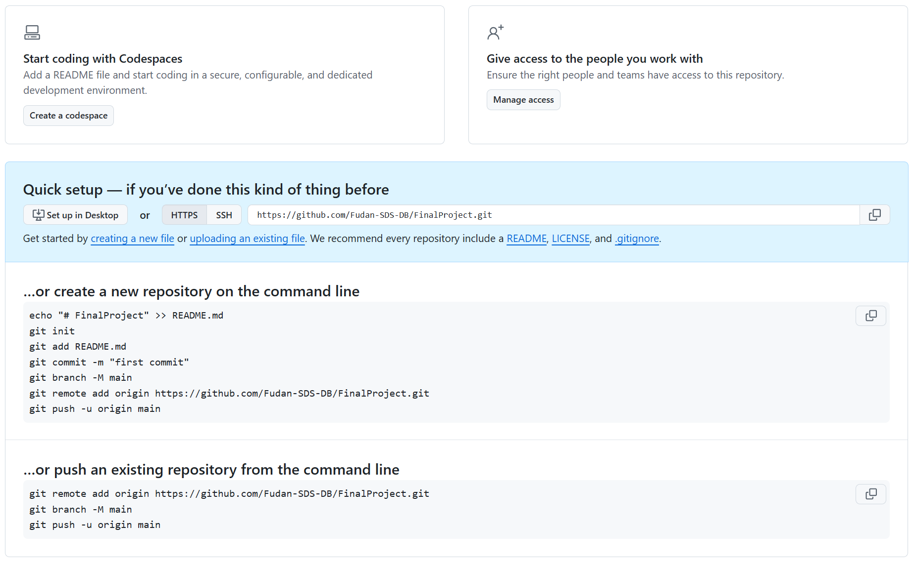

# 项目起步

## 项目环境

- **操作系统**：Windows 11  
- **Python 版本**：3.11.9  
- **Django 版本**：4.2.5  

> 这里默认你已经安装好了 Python、VSCode 和 Git。使用 macOS 的同学按相同步骤操作，效果应一致。

## 初始化 Django 项目

1. 在桌面路径（如 `C:\Users\<你的用户名>\Desktop`）下打开 VSCode。
2. 打开终端（快捷键 Ctrl + `）。
3. 安装 Django：
   ```powershell
   pip install django
   ```
   ```powershell
   # 如果访问 PyPI 较慢，可以使用清华镜像源
   pip install django -i https://pypi.tuna.tsinghua.edu.cn/simple
   ```
4. 安装完成后，使用以下命令初始化一个 Django 项目，其中 `FinalProject` 可替换为你的项目名：
   ```powershell
   django-admin startproject FinalProject
   ```
5. 进入项目文件夹并用 VSCode 打开：
   ```powershell
   cd FinalProject
   code .  # 当前目录下打开 VSCode
   ```

## 项目结构简介

进入 `FinalProject` 目录后，你将看到如下文件结构：

```txt
FinalProject/
├── FinalProject/
│   ├── __init__.py
│   ├── asgi.py
│   ├── settings.py
│   ├── urls.py
│   └── wsgi.py
└── manage.py
```

各文件作用如下：

### `manage.py`
Django 项目管理脚本，支持运行开发服务器、数据库迁移、创建应用和超级用户等操作。

常用命令示例：
- `python manage.py runserver`
- `python manage.py migrate`
- `python manage.py makemigrations`
- `python manage.py startapp <app_name>`
- `python manage.py createsuperuser`

### `__init__.py`
标识该目录为 Python 包，通常为空。

### `asgi.py`
ASGI（异步服务器网关接口）入口，用于部署异步 Web 应用。

### `settings.py`
项目的主配置文件，包含：
- `DATABASES`：数据库设置
- `INSTALLED_APPS`：注册的应用
- `MIDDLEWARE`：中间件列表
- `TEMPLATES`：模板配置

### `urls.py`
URL 路由配置文件，用于将 URL 映射到对应视图。例如：
```python
from django.urls import path
from . import views

urlpatterns = [
    path('', views.index, name='index'),
]
```

### `wsgi.py`
WSGI（同步服务器网关接口）入口，用于部署到生产环境的 Web 服务器。

> 在开发中，我们主要会修改 `settings.py` 和 `urls.py` 这两个文件。

## 创建其他必要文件

### 创建 `.gitignore`
用于忽略不需要提交到 GitHub 的文件。可以使用插件自动生成，也可以手动添加以下内容：

```txt
# Python 生成的缓存文件夹
__pycache__/  

# Django 数据库迁移目录
migrations/   

# 日志与本地配置
*.log
local_settings.py
db.sqlite3
db.sqlite3-journal
```

:::tip 提示
避免将大文件提交到 GitHub，否则会导致仓库膨胀、推送失败。同时，也不要提交本地配置相关的文件，以免影响其他开发者的环境。

可根据实际开发情况动态调整 `.gitignore` 内容。
:::

### 创建 `README.md`

可以记录项目名称、结构、运行方式等内容，方便协作者快速上手。建议在开发过程中持续完善。

## Git & GitHub 初始化

### 初始化 Git 仓库

在项目根目录下运行：

```powershell
git init
```

### 本地提交

```powershell
# 添加当前目录下的所有文件到 Git 的暂存区
git add .

# 提交暂存区中的文件，并添加提交信息
git commit -m "First commit, create template project from django"
```

成功后会看到类似输出：

```txt
8 files changed, 212 insertions(+)
create mode 100644 .gitignore
create mode 100644 FinalProject/__init__.py
create mode 100644 FinalProject/asgi.py
create mode 100644 FinalProject/settings.py
create mode 100644 FinalProject/urls.py
create mode 100644 FinalProject/wsgi.py
create mode 100644 README.md
create mode 100644 manage.py
```

### 在 GitHub 创建仓库  
（一个小组中只需一人创建）

1. 打开 [GitHub 官网](https://github.com)，点击右上角头像，选择 **"Your repositories"（你的仓库）**。  
2. 点击页面右上角的 **"New"** 按钮，你将看到如下界面：<p align="center"></p>
3. 按照以下要求填写仓库信息：  
   - **Repository name（仓库名称）**：自定义项目名称。  
   - **Visibility（可见性）**：选择 **Private（私有）**，防止项目代码被公开。  
   - 由于我们已经在本地创建了 `README.md` 和 `.gitignore`，所以无需勾选相应选项。  
   - **License（许可证）** 一项主要用于开源项目，本课程中可以忽略。若后续考虑将项目开源，可进一步了解相关内容。
4. 创建完成后，你将看到如下界面：
   - 左上角的 **Codespaces** 可忽略。  
   - 右上角的 **Manage access** 可用于邀请其他组员协作开发。  
   - 页面中部提供了将本地仓库关联到 GitHub 仓库的命令。由于我们已经在本地初始化过 Git 仓库，因此请复制 **“push an existing repository from the command line”** 部分的命令到 VSCode 终端中执行（❗请记得将链接替换为你自己的远程仓库地址）：
   ```powershell
   # 设置本地仓库的远程地址 origin
   git remote add origin https://github.com/Fudan-SDS-DB/FinalProject.git

   # 重命名当前分支为 main
   git branch -M main

   # 将本地 main 分支推送到远程仓库
   git push -u origin main
   ```
   :::warning 提示  
   如果遇到如下报错，说明 GitHub 的 DNS 在部分地区可能受到干扰，无法连接服务器。建议稍后重试，或使用 GitHub Desktop 推送代码。

   ```txt
   fatal: unable to access 'https://github.com/Fudan-SDS-DB/FinalProject.git/': 
   Failed to connect to github.com port 443 after 21047 ms: Could not connect to server
   ```
   :::

### 拉取远程仓库  

当仓库创建完成并添加协作者后，小组其他成员可以使用如下命令将远程仓库克隆到本地（❗请替换为小组项目的仓库链接）：

```powershell
git clone https://github.com/Fudan-SDS-DB/FinalProject.git
```


---

项目初始化完成！下一步我们将连接数据库并进行验证。
