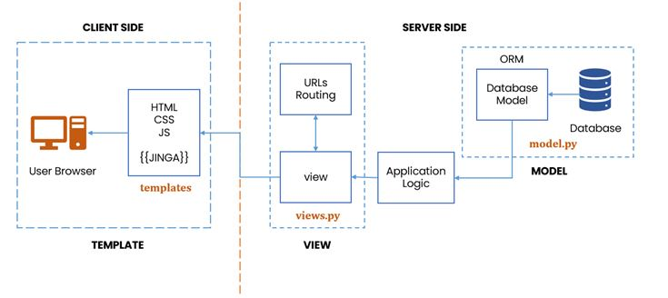

# 框架概览

## Django 简介

**Django** 是一个由 Python 编写的高级 Web 开发框架，致力于帮助开发者**快速、高效地构建可维护的网站和 Web 应用**。它遵循 “DRY（Don't Repeat Yourself）” 和 “快速开发” 的设计理念，减少重复劳动，提升开发效率。

Django 提供了从 **数据库建模、视图逻辑、模板渲染，到用户认证、后台管理、表单验证** 等一整套功能，几乎可以做到“开箱即用”，非常适合用于中小型项目、管理系统，甚至大型网站的开发。

在本项目中，我们将以 Django 作为主要开发框架，搭建一个简单的示例网站，涵盖常见的 Web 开发流程和功能模块，供大家参考和学习。

## Django 架构

Django 使用的是 **MTV 架构模式**（Model - Template - View），三个核心组件分别承担不同的职责，并依托 Django 提供的一系列核心技术共同完成完整的 Web 请求响应流程：

- **Model（模型）**：用于定义数据库的结构（即数据表 schema），并封装数据访问逻辑。Django 提供了强大的 **ORM（Object-Relational Mapping）** 系统，使我们可以使用 Python 类和对象直接对数据库进行增删改查，无需编写 SQL。模型通常定义在 `models.py` 文件中。
- **View（视图）**：负责接收 HTTP 请求、执行业务逻辑，并返回 HTTP 响应。Django 支持两种视图编写方式：**函数视图（Function-based View）** 和 **类视图（Class-based View）**，便于根据场景选择更合适的结构。视图通常定义在 `views.py` 文件中。
- **Template（模板）**：用于定义返回给用户的 HTML 页面结构。Django 提供了一套简单易用的 **模板语言（Django Template Language, DTL）**，支持变量插值、逻辑控制、模板继承等功能，模板文件通常位于 `templates/` 目录下。

> 💡 在后续的开发中，我们主要会围绕这三部分编写代码，并逐步熟悉 Django 的数据建模、请求处理和页面渲染流程。

## 其他开发框架

- 在 Python 生态中，除了 Django，常见的 Web 开发框架还包括：
  - [**Flask**](https://flask.palletsprojects.com/en/stable/)：轻量灵活，适合小型项目和微服务架构。
  - [**FastAPI**](https://fastapi.tiangolo.com/)：基于 Python 类型注解，支持异步编程，性能优越，近年流行度快速上升。
- 我们鼓励大家在期末项目中探索不同的技术栈，也欢迎选择 Java、C++ 等其他语言进行开发。
- 不过考虑到大多数同学的学习曲线和上手成本，本课程的示例项目将采用 Django，它对初学者更友好，同时也能很好地帮助理解 Web 应用的基本结构与逻辑。

:::details 💬 碎碎念  
目前不少互联网公司在后端开发中主要采用 **Java** 或 **Go**。  

Java 拥有成熟的 **Spring** 框架，生态非常完善，是后端开发的主力军之一；而 Go 则以其轻量、简单、并发性强（基于 goroutine）等优势，逐渐成为新一代后端开发的热门语言。  

如果你对后端开发感兴趣，不妨关注一下这些方向～
:::

<Giscus />