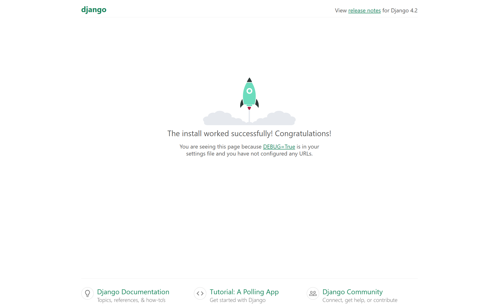

# 数据库配置

这里默认大家安装好 MySQL，创建好用户，且 MySQL 服务处于运行状态

## 安装数据库驱动
推荐使用性能更优的 `mysqlclient` 驱动：
```bash
pip install mysqlclient
```

Windows 用户如遇编译问题，可使用纯 Python 实现的 `PyMySQL`：
```bash
pip install pymysql
```

并在 Django 项目的 `__init__.py` 文件中添加如下代码，使其兼容 `MySQLdb` 接口：
```python
import pymysql
pymysql.install_as_MySQLdb()
```

## 创建数据库
使用 MySQL 命令行工具、Workbench 或 VSCode 插件，在 MySQL 中创建项目数据库：
```sql
-- 将 FinalProject 替换为你实际使用的数据库名称
CREATE DATABASE FinalProject
    DEFAULT CHARACTER SET = 'utf8mb4';
```


## 配置 Django 数据库连接

### 修改 `DATABASES` 配置
打开 `FinalProject/settings.py`，找到 `DATABASES` 配置，修改为如下内容：
```python
DATABASES = {
    'default': {
        'ENGINE': 'django.db.backends.mysql',
        'NAME': 'FinalProject', # 数据库名称
        'USER': 'root',         # 用户名
        'PASSWORD': '123456',   # 密码
        'HOST': 'localhost',
        'PORT': '3306',         # MySQL 服务器端口
        'OPTIONS': {
            'init_command': "SET sql_mode='STRICT_TRANS_TABLES'",
        },
    }
}
```
请根据你的实际情况修改 `NAME`、`USER` 和 `PASSWORD` 字段的值。


**❗注意：由于小组成员的 MySQL 用户名和密码可能不同，建议将数据库连接信息提取到环境变量中，避免每次拉取项目后都需要修改 <code>settings.py</code> 文件。**


为此，我们推荐使用 `django-environ` 库来统一管理环境变量。
```bash
pip install django-environ
```
在 `settings.py` 顶部引入并初始化环境变量读取：

```python
import environ

# 初始化环境变量
env = environ.Env()
# 读取 .env 文件中的配置
environ.Env.read_env()  
```

然后将原有的 `DATABASES` 配置修改为：
```python
DATABASES = {
    'default': {
        'ENGINE': 'django.db.backends.mysql',
        'NAME': env('DB_NAME'),             # 从环境变量获取数据库名
        'USER': env('DB_USER'),             # 从环境变量获取用户名
        'PASSWORD': env('DB_PASSWORD'),     # 从环境变量获取密码
        'HOST': env('DB_HOST', default='localhost'),
        'PORT': env('DB_PORT', default='3306'),
        'OPTIONS': {
            'init_command': "SET sql_mode='STRICT_TRANS_TABLES'",
        },
    }
}
```

### 添加 `.env` 文件
在项目根目录（即 `settings.py` 所在目录）下创建一个 `.env` 文件，添加如下内容：
```ini
DB_NAME=FinalProject
DB_USER=root
DB_PASSWORD=123456
DB_HOST=localhost
DB_PORT=3306
```

每位成员根据自己的本地数据库配置创建并修改 `.env` 文件即可，无需改动代码或配置文件。

**此外，我们需要将 `.env` 文件添加至 `.gitignore`，避免其被上传至 Git 仓库，以保护敏感信息并防止配置冲突。**

## 执行数据库迁移
在终端中运行以下命令，完成数据库结构初始化：
```bash
python manage.py migrate
```
若无任何错误提示，则说明数据库连接配置成功。


## 测试数据库连接（可选）
你可以运行如下命令，进一步验证数据库连接是否正常：
```bash
python manage.py dbshell
```
如果成功进入 MySQL 命令行，则说明配置无误。

## 启动项目服务
在数据库连接无误的前提下，可通过以下命令启动开发服务器：
```bash
python manage.py runserver
```

若配置无误，将看到类似如下输出：
```txt
Watching for file changes with StatReloader
Performing system checks...

System check identified no issues (0 silenced).
April 13, 2025 - 09:36:47
Django version 4.2.5, using settings 'FinalProject.settings'
Starting development server at http://127.0.0.1:8000/
Quit the server with CTRL-BREAK.
```

在浏览器中访问 http://127.0.0.1:8000/ ，你将看到 Django 提供的默认欢迎页面，表明系统运行正常 


:::tip 扩展
学过计算机网络的同学可能知道，127.0.0.1 是一个保留的 IP 地址，代表本地回环地址，也称为本机地址。而端口号 8000 是 Django 默认的开发服务器端口，表示 Django 将 web 界面部署在本机的 8000 端口上。我们通过浏览器访问 127.0.0.1:8000，即可访问本机上运行的 web 应用。

除此之外，计算机网络中还有许多保留的 IP 地址和常用端口。例如，127.0.0.0 到 127.255.255.255 是保留给本地回环的 IP 地址，通常只在本机使用。SSH 服务通常使用端口号 22，而 MySQL 数据库则使用端口号 3306。感兴趣的同学可以进一步 Google 了解计算机网络中的保留 IP 地址和常用端口号。
:::


## 提交
配置完成后，记得将所有修改提交到远程 Git 仓库，确保项目的最新配置能够同步。你可以使用以下命令将更改提交：
```bash
git add .
git commit -m "Configure DATABASE in settings.py to connect django with mysql"
git push -u origin main
```
通过这一步，你的数据库配置就已经同步到 GitHub 等远程仓库，确保团队成员可以访问并保持项目的一致性。
