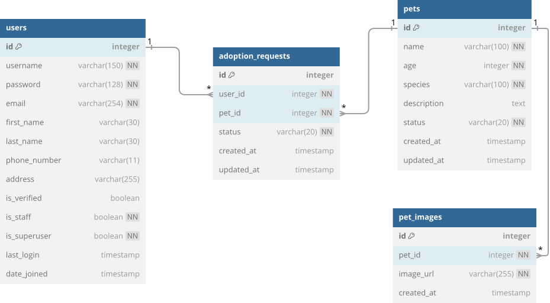

# 数据表创建

## 示例选题介绍
本平台是一个简单的宠物领养系统，主要功能包括：
- 展示可供领养的宠物信息，允许用户申请领养或取消申请；
- 后台管理员管理宠物信息并审核领养请求。

下图展示了本系统的数据库表结构：


### `users` 表（用户信息）

Django 默认的用户模型 `User` 基于 `AbstractUser` 类进行扩展，提供了身份验证、权限管理和用户信息存储等功能。以下是基于 `User` 模型扩展的 `users` 表字段说明：

| 字段名        |     类型      | 非空 | 唯一 |      默认值       |
|:-------------:|:-------------:|:----:|:----:|:-----------------:|
| `id`          | `SERIAL`      |  是  |  是  |    自动递增       |
| `username`    | `VARCHAR(150)`|  是  |  是  |         -         |
| `password`    | `VARCHAR(128)`|  是  |  否  |         -         |
| `email`       | `VARCHAR(254)`|  是  |  是  |         -         |
| `first_name`  | `VARCHAR(30)` |  否  |  否  |         -         |
| `last_name`   | `VARCHAR(30)` |  否  |  否  |         -         |
| `phone_number`| `VARCHAR(11)` |  否  |  否  |         -         |
| `address`     | `VARCHAR(255)`|  否  |  否  |         -         |
| `is_staff`    | `BOOLEAN`     |  是  |  否  |       FALSE       |
| `is_superuser`| `BOOLEAN`     |  否  |  否  |       FALSE       |
| `is_active`   | `BOOLEAN`     |  是  |  否  |       TRUE        |
| `date_joined` | `TIMESTAMP`   |  是  |  否  | CURRENT_TIMESTAMP |

> **用户信息表**基于 Django 默认用户模型进行扩展，旨在支持区分普通用户与具有后台管理权限的管理员。该表记录每个用户的基本信息，确保 `username` 和 `email` 字段唯一，以便通过这些字段唯一标识用户。字段 `is_staff` 和 `is_superuser` 用于区分普通用户与拥有管理权限的用户，而 `is_active` 表示用户账户的活动状态。字段 `date_joined` 用于记录用户的注册时间。

---

### `pets` 表（宠物信息）

| 字段名       |     类型     | 非空 | 唯一 |      默认值       |
|:------------:|:------------:|:----:|:----:|:-----------------:|
| `id`         | `SERIAL`     |  是  |  是  |    自动递增       |
| `name`       | `VARCHAR(100)`|  是  |  否  |         -         |
| `age`        | `INT`        |  是  |  否  |         -         |
| `species`    | `VARCHAR(100)`|  是  |  否  |         -         |
| `description`| `TEXT`       |  否  |  否  |         -         |
| `status`     | `VARCHAR(20)`|  是  |  否  |  CHECK 约束限制   |
| `created_at` | `TIMESTAMP`  |  是  |  否  | CURRENT_TIMESTAMP |
| `updated_at` | `TIMESTAMP`  |  是  |  否  | CURRENT_TIMESTAMP |

> **宠物信息表**记录了每只宠物的基本信息及其领养状态。表中的 `status` 字段通过 `CHECK` 约束限定可能的值为 `available`（可领养）或 `adopted`（已领养）。此外，`created_at` 和 `updated_at` 字段分别记录了宠物信息的创建时间和最后更新时间，确保信息的时效性和一致性。

---

### `adoption_requests` 表（领养申请）

| 字段名      |     类型     | 非空 | 唯一 |      默认值       |
|:-----------:|:------------:|:----:|:----:|:-----------------:|
| `id`        | `SERIAL`     |  是  |  是  |    自动递增       |
| `user_id`   | `INT`        |  是  |  否  | 外键 → users(id)  |
| `pet_id`    | `INT`        |  是  |  否  | 外键 → pets(id)   |
| `status`    | `VARCHAR(20)`|  是  |  否  |  CHECK约束限制    |
| `created_at`| `TIMESTAMP`  |  是  |  否  | CURRENT_TIMESTAMP |
| `updated_at`| `TIMESTAMP`  |  是  |  否  | CURRENT_TIMESTAMP |

> **领养申请表**记录了每个用户对宠物的领养申请。表中的 `user_id` 和 `pet_id` 组合为唯一约束，确保一个用户不能对同一只宠物提交多个领养申请。字段 `status` 通过 `CHECK` 约束限定了状态的可能值为 `pending`（待审核）、`approved`（已批准）或 `cancelled`（已取消）。此外，`created_at` 和 `updated_at` 字段分别记录了申请的创建时间和最后更新时间，确保数据的时效性和准确性。

---

### `pet_images` 表（宠物图片）

| 字段名     |     类型     | 非空 | 唯一 |      默认值       |
|:----------:|:------------:|:----:|:----:|:-----------------:|
| `id`       | `SERIAL`     |  是  |  是  |    自动递增       |
| `pet_id`   | `INT`        |  是  |  否  | 外键 → pets(id)   |
| `image_url`| `VARCHAR(255)`|  是  |  否  |         -         |
| `created_at`| `TIMESTAMP` |  是  |  否  | CURRENT_TIMESTAMP |

> **宠物图片表**用于存储与每只宠物相关的多张图片。每张图片的 URL 地址存储在 `image_url` 字段中，`pet_id` 作为外键，指向 `pets` 表中的对应记录，确保图片与宠物之间的关联性。字段 `created_at` 记录了图片上传的时间，确保图片数据的有效性和时效性。


## 在 Django 中创建数据表

在 Django 中，数据表的创建通常是通过模型类（Model）来完成的。以下是根据上述设计的 Django 模型实现：

```python
from django.db import models
from django.contrib.auth.models import AbstractUser

# 用户信息表模型
class User(AbstractUser):
    phone_number = models.CharField(max_length=15, blank=True, null=True)
    address = models.CharField(max_length=255, blank=True, null=True)
    
# 宠物信息表模型
class Pet(models.Model):
    STATUS_CHOICES = [
        ('available', '可领养'),
        ('adopted', '已领养'),
    ]
    
    name = models.CharField(max_length=100)
    age = models.IntegerField()
    species = models.CharField(max_length=100)
    description = models.TextField(blank=True, null=True)
    status = models.CharField(max_length=20, choices=STATUS_CHOICES)
    created_at = models.DateTimeField(auto_now_add=True)
    updated_at = models.DateTimeField(auto_now=True)

    def __str__(self):
        return self.name

# 领养申请表模型
class AdoptionRequest(models.Model):
    STATUS_CHOICES = [
        ('pending', '待审核'),
        ('approved', '已批准'),
        ('cancelled', '已取消'),
    ]
    
    user = models.ForeignKey(User, on_delete=models.CASCADE)
    pet = models.ForeignKey(Pet, on_delete=models.CASCADE)
    status = models.CharField(max_length=20, choices=STATUS_CHOICES)
    created_at = models.DateTimeField(auto_now_add=True)
    updated_at = models.DateTimeField(auto_now=True)

# 宠物图片表模型
class PetImage(models.Model):
    pet = models.ForeignKey(Pet, on_delete=models.CASCADE)
    image_url = models.CharField(max_length=255)
    created_at = models.DateTimeField(auto_now_add=True)
```

上述模型类在 Django 中的数据库迁移操作将自动创建相应的数据表。在命令行中执行以下命令来生成并应用迁移：

```bash
python manage.py makemigrations
python manage.py migrate
```

这段代码将自动在数据库中创建相应的数据表，并应用所有设计好的约束和关系。