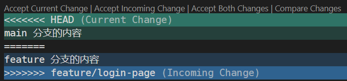

# Git & GitHub

Git 是一个分布式版本控制系统，能够跟踪代码的修改历史，支持分支管理和多人协作开发。它可以记录每一次更改，允许开发者随时回退到旧版本，也方便地合并不同分支的代码。

GitHub 则是一个基于 Git 的在线代码托管平台，提供远程仓库，方便开发者存储、管理代码，并支持团队成员之间的高效协作。

> 简而言之：**Git 负责本地版本管理，GitHub 实现远程代码托管与协作。**

在本次期末项目中，我们要求大家使用 Git 进行版本控制，并将项目代码托管在 GitHub 上。我们会通过你们的 commit 记录来了解项目进展，因此请务必规范使用！

:::danger
往届有同学通过微信群互传 `.zip` 压缩包来合作开发。这种方式效率低，无法追踪文件修改记录，也无法回退版本。一旦出现 bug，会严重影响项目进度，甚至打击团队协作积极性。**所以我们要求大家从一开始就使用规范的 Git 工作流！**
:::

## Git 基本操作

关于 Git 的基本用法，推荐大家阅读这篇内容详实的 [使用指南](https://comp101.fducslg.com/tools/git-and-github)，助教就不重复造“轮子”了😀

## 一些补充

- **Git 命令很多，一开始可能有点懵**。别担心，其实掌握几个常用操作就够用了，比如添加文件、提交修改（commit）、拉取/推送（pull/push）、切换分支。其他操作等用到的时候再去查就行～  
  > 友情提示：STFW（Search The Fuxxing Web）+ 善用大模型，事半功倍！
- **不推荐使用学邮注册 GitHub 账号**，`@m.fudan.edu.cn` 的邮箱在毕业后会被回收，可能影响账户安全。
- **推荐使用 `.gitignore` 文件来避免提交不必要的文件**。  
  安装 [gitignore 插件](https://marketplace.visualstudio.com/items?itemName=codezombiech.gitignore) 后，在 VSCode 中使用快捷键 `Ctrl + Shift + P`，输入 "Add gitignore"，选择项目语言（如 Python）即可快速生成模板。
- **如果你对命令行不熟悉，推荐使用 [GitHub Desktop](https://desktop.github.com/download/)**  
这是 GitHub 官方提供的可视化工具，支持拖动文件、点击按钮完成提交、合并等操作。  
  > （悄悄说一句：助教大二做数据库项目的时候也是靠这个活下来的🤣）
- **当你合并分支时，可能会遇到冲突**。VSCode 会显示类似以下格式：
  - 请根据实际需要，选择其中一种处理方式：
    - Accept Current（保留当前分支内容）
    - Accept Incoming（保留另一个分支内容）
    - Accept Both（保留两边内容，手动整理）
- 在 VSCode 中，安装 GitLens 插件可以大大增强 Git 可视化体验：
  - 将鼠标悬停在某一行代码上，即可显示最后修改该行的作者和 commit 信息；
  - 右键点击可查看该文件或某一行的历史版本；
  - 支持 Git Blame 可视化，方便了解每一行代码的责任人；
  - 更多功能欢迎大家自行探索～
  > 顺便推荐一个有趣的 StackOverflow 问答：[What does git blame do?](https://stackoverflow.com/questions/31203001/what-does-git-blame-do) 