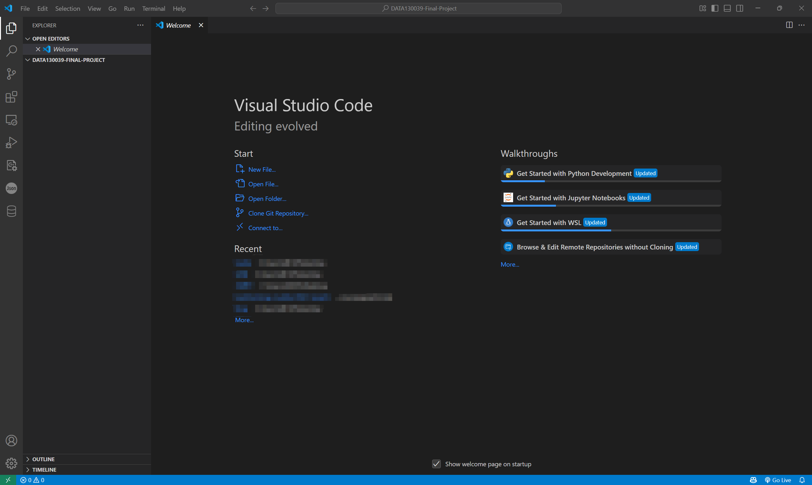

# Git & Github
> Git 是一个分布式版本控制系统，用于跟踪代码修改历史，支持分支管理和多人协作。它可以记录代码的每一次更改，允许开发者随时回溯到旧版本，并方便地合并不同分支的代码。GitHub 则是一个基于 Git 的在线代码托管平台，提供远程仓库，让开发者能够在线存储、管理代码，并支持团队协作开发。简单来说，Git 负责在本地管理代码版本，而 GitHub 作为远程仓库，实现代码的共享和协作。开发者可以在本地用 Git 进行代码管理，再通过 GitHub 推送（push）代码，与团队成员共享和协作开发。在本次期末项目中，我们将要求大家使用 Git 进行版本管理，并使用 GitHub 托管项目代码。检查期末项目时，我们将会检查你们的 commit 记录，跟踪你们的项目进度。

## 安装 Git
- 可以参考 [Git 下载安装教程](https://zhuanlan.zhihu.com/p/443527549)

## 创建 GitHub 账号
- https://www.github.com
:::warning
这里不推荐大家使用学邮注册 GitHub 账号，因为带 `@m.fudan.edu.cn` 后缀的邮箱将在毕业后被回收
:::

## 创建项目
> 这里我们默认同学们已经安装好了前面推荐的 [插件](./vscode.md#三-git-使用相关插件)

### 创建空文件夹
- 在桌面上创建空文件夹 `DATA130039-Final-Project`
- 在 VSCode 中按 `Ctrl + K` ，再按 `Ctrl + O`，打开新创建的空文件夹
- 你将看到以下界面 

### 初始化本地仓库
