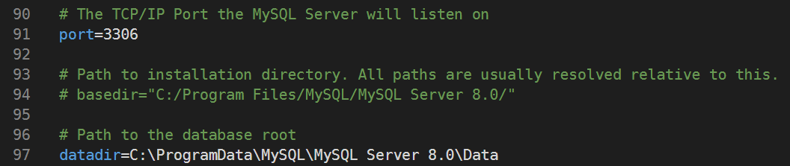
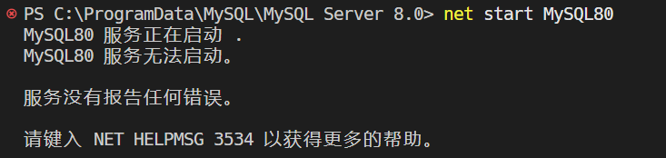
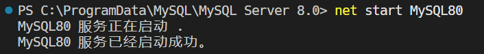
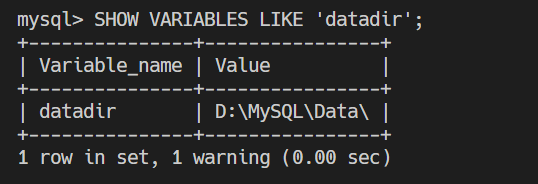

# MySQL

> MySQL 是一款开源的关系型数据库管理系统（RDBMS），最初由瑞典 MySQL AB 公司开发，现由 Oracle 公司负责维护和支持。作为全球最流行的数据库之一，MySQL 被广泛应用于 Web 开发、数据分析等众多场景。在本课程的期末项目中，我们将使用 MySQL 作为后端数据库。


## 安装 MySQL

- ~~助教本来想亲自写安装教程，但网上已经有详尽的现成资料，所以……选择开摆 😊~~
- Windows 用户推荐参考：[超级详细的 MySQL 数据库安装指南](https://zhuanlan.zhihu.com/p/37152572)
- macOS 用户推荐参考：[Mac 下 MySQL 的安装步骤](https://zhuanlan.zhihu.com/p/37942063)


## 注意事项

- 推荐使用 [MySQL Installer](https://dev.mysql.com/downloads/installer/) 进行安装。
- 安装 `.msi` 文件时，如果点击没反应，请右键选择“以管理员身份运行”。
  > 因为 MySQL 安装时需要在 C 盘创建目录，没有管理员权限就会卡住。
- MySQL 默认端口是 `3306`。如果你在安装过程中改了端口，一定要记住它！Django 连接数据库时要用。
- 安装过程中设置的 `root` 密码非常重要，请务必妥善保管——之后登录 MySQL 和连接数据库都需要用到。
- 若在 PowerShell 中运行 `mysql` 命令时遇到以下报错，请将 `C:\Program Files\MySQL\MySQL Server 8.0\bin` 目录添加到系统的环境变量中
  ```text
  mysql : 无法将“mysql”项识别为 cmdlet、函数、脚本文件或可运行程序的名称。
  请检查名称的拼写，如果包括路径，请确保路径正确，然后再试一次。
  ```
  > 该报错的原因是 PowerShell 在执行命令时，会从系统的默认路径以及已配置的环境变量 `PATH` 中查找 `mysql`。如果未找到相应路径，则会出现此错误

  :::tip
  使用 Mac 的同学可以思考一下，为什么你们通常不会遇到这个问题呢？

  系统默认的 `PATH` 都包含哪些路径？不妨试着 Google 一下，或者问问某个很会聊天的大模型 😏
  :::
- 有些同学可能会使用 MySQL Workbench 来编写 SQL 脚本，但它在代码补全、报错提示和可视化方面略显笨重。那么，是否有更便捷高效的 [工具](./vscode.md#四-mysql-数据库支持) 呢？


## 修改数据库配置
> 在今天早上的上机实验中，不少同学在修改数据库配置时遇到了一些问题。我们在 Windows 11 环境下复现了相关情况，并整理出以下参考，供大家查阅。感兴趣的同学可以跟着操作，也欢迎进一步探索。

### 实验环境
- Windows 11
- Ver 8.0.41 for Win64 on x86_64 (MySQL Community Server - GPL)
- Server 安装了路径 `C:\Program Files\MySQL\MySQL Server 8.0`
- Data 默认地址 `C:\ProgramData\MySQL`

### 寻找配置文件
- 打开服务管理器：按住 `Win + R`，输入 `services.msc` 回车
- 找到名为 `MySQL80` 的服务，双击打开
- 查看“可执行文件路径”，你应该能看到如下内容：
  ```text
  C:\Program Files\MySQL\MySQL Server 8.0\bin\mysqld.exe" 
  --defaults-file="C:\ProgramData\MySQL\MySQL Server 8.0\my.ini" MySQL80
  ```
  - 其中 `--defaults-file` 指定的路径就是当前使用的配置文件
  - 哦！原来我们的配置文件现在被放在 `ProgramData` 目录下了，那么按照以前教程写的地址就是不对的！！！
:::tip
遇到找不到配置文件的情况时，可以思考：我们是不是该换个角度提问，比如问“如何定位 MySQL 当前使用的配置文件”，而不是死磕在如何创建配置文件上？
:::

### 修改配置文件
- Windows 自带的记事本对 `.ini` 文件支持较差，建议使用 VSCode 打开 `C:\ProgramData\MySQL\MySQL Server 8.0` 文件夹
:::warning 权限提醒
该路径位于 `C:\ProgramData` 下，修改文件需要管理员权限。请以管理员身份启动 VSCode，然后再打开对应文件夹。
:::
- 找到配置文件中的 `datadir` 字段 
- 将 `datadir` 修改为 `D:\MySQL\Data`
- 手动在 D 盘下新建 `D:\MySQL\Data` 文件夹

### 重启 MySQL 服务
配置修改后，必须重启 MySQL 服务，新的配置才能生效。你可以选择以下任意一种方式：
- 方式一：服务界面中点击“重新启动”
- 方式二：使用终端命令（需要管理员权限）
  ```bash
  net stop MySQL80
  net start MySQL80
  ```
- OOPS！好像启动不了了，这是什么情况？？？
- 对了，我们是不是应该把 `C:\ProgramData\MySQL\MySQL Server 8.0\Data` 下的所有文件复制到 `D:\MySQL\Data` 文件夹下呢
:::details 为什么需要复制 `Data` 文件夹呢
原始 Data 文件夹中包含了 MySQL 正常启动所必需的内容，包括：
- 系统数据库（`mysql`）：存储用户账户、权限配置等关键信息
- InnoDB 引擎核心文件（如 `ibdata1`、`ib_logfile*`）
- 你已有的实际数据库文件夹
- MySQL 内部元数据和配置信息

如果缺少这些文件，MySQL 将无法正常初始化或启动。
:::
- 复制完成后再次尝试启动服务，应该就可以看到如下提示了 

### 验证配置是否生效
- 登录 MySQL 后，执行以下 SQL 语句（记得加分号），检查 datadir 是否已更新为新路径
  ```sql
  SHOW VARIABLES LIKE 'datadir';
  ```
- 得到以下输出，成功！

### 一些参考资料
- [MySQL 8.0.26 doesn't start after saving my.ini](https://serverfault.com/questions/1073117/mysql-8-0-26-doesnt-start-after-saving-my-ini)
- [Not able to find the my.ini file](https://www.reddit.com/r/mysql/comments/1fl657q/not_able_to_find_the_myini_file/)
- [MySql 8.0 starts and stops after my.ini saved or edited in Windows 10](https://superuser.com/questions/1421016/mysql-8-0-starts-and-stops-after-my-ini-saved-or-edited-in-windows-10)
- [How to change MySQL data directory?](https://stackoverflow.com/questions/1795176/how-to-change-mysql-data-directory#:~:text=In%20case%20you%27re%20a%20Windows%20user%20and%20landed%20here%20to%20find%20out%20that%20all%20answers%20are%20for%20Linux%20Users%2C%20don%27t%20get%20disappointed!%20I%20won%27t%20let%20you%20waste%20time%20the%20way%20I%20did.)

### 一些建议
- 助教注意到不少同学通过百度、CSDN 等方式查找 MySQL 配置方法。但这类平台内容质量参差不齐，且优质内容往往需要付费，影响了大家的学习体验。
- 建议大家多尝试使用 Google、StackOverflow 等平台查找技术问题，这些平台对编程类内容的支持更专业。
- 使用大模型时，建议提供更完整的问题描述，适当调整提问方式（prompt），不同的表述方式会带来截然不同的回答。
- 编程类课程中，遇到 bug 和报错是再正常不过的事情，希望同学们具备直面错误的勇气，并努力提升排查问题、搜索资料、独立解决的能力。你遇到的问题，大概率网上已经有人遇到过 —— 多动动手，STFW!