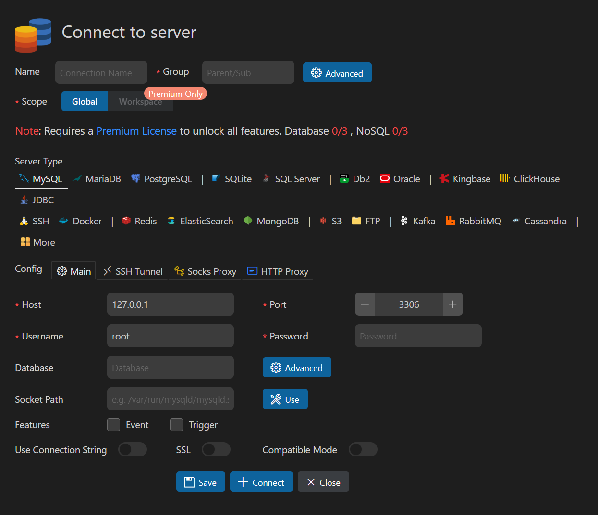
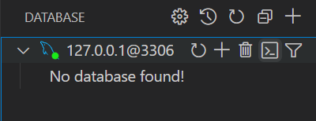

# VSCode
> Visual Studio Code（简称 VS Code）是由微软开发的一款免费、开源、轻量级的代码编辑器。它支持多种编程语言，并具有强大的扩展功能，适用于前端开发、后端开发、数据科学、DevOps 等多个领域。考虑到大部分同学使用 Python 进行编程，并且期末项目可能涉及前端开发，我们推荐大家使用 VSCode 来进行期末项目的开发。

## 安装 VSCode
- 可以参考这份 [VSCode 详细安装教程](https://zhuanlan.zhihu.com/p/264785441)

## 安装插件
> 安装完 VSCode 后，它本身相当于一个功能简化的“记事本”。真正让它具备强大功能的是各种扩展插件。以下是为支持 Python 编程、前端开发、数据库操作等场景推荐的一些实用插件。

### 一. 功能类插件
#### 语言包
  - Chinese (Simplified) Language Pack for Visual Studio Code（简体中文语言包）
#### 错误提示增强
  - Error Gutters  
  - Error Lens
#### Markdown 支持
  - Markdown All in One  
  - Markdown Preview Enhanced  
  :::tip 小贴士
  在标准项目中，我们通常会提供一个 `README.md` 文件（相信大家在 GitHub 上的项目仓库中也见过）。这个文件是你向他人介绍项目内容的重要窗口，它应当包括项目结构、依赖环境、运行方法等关键信息
  :::
  :::details 建议同学们学习 Markdown 的基本语法（如标题、加粗、列表、代码块等）
  - [Markdown 入门](https://comp101.fducslg.com/tools/markdown1)
  - [Markdown 进阶](https://comp101.fducslg.com/tools/markdown2)
  :::
#### 路径提示与自动补全
  - Path Intellisense    
  :::warning    
  开发过程中请熟悉“绝对路径”与“相对路径”的区别。一般来说，为保证项目的可移植性，我们推荐使用相对路径。同时，**请务必以“文件夹”形式打开整个项目**，而不是直接用 VSCode 打开单个文件。
  :::
#### 代码格式与数据文件支持
  - Prettier - Code formatter（统一代码格式）  
  - Prettify JSON（JSON 美化）  
  - Rainbow CSV（CSV 文件高亮）
#### PDF 文件阅读
  - vscode-pdf

### 二. Python 开发相关插件
- Python Extension Pack（Python 官方推荐插件合集）
- MagicPython（增强语法高亮）
- Black Formatter（代码风格统一工具）
- Pylance（类型检查与智能补全）
- Django（提供模板语法高亮、自动补全、模型字段提示等功能）

### 三. Git 使用相关插件
- GitLens（强大的 Git 历史和代码变更可视化工具）  
- Git History（查看提交历史）  
- gitignore（可自动拉取常见 `.gitignore` 模板，下一节将详细介绍其作用）

### 四. MySQL 数据库支持
#### MySQL
  - 安装插件后，在左侧导航栏点击 **Database**，选择 **Create Connection** 创建连接  
  - 在弹出的连接配置窗口中填写数据库连接信息，特别是密码字段，然后点击 **Connect**  
    
  - 连接成功后，重新点击左侧导航栏的 **Database**，将看到如下界面：  
    

      
    

  - 在此界面中，你可以创建数据表、编写 SQL 语句（插件提供代码高亮与自动补全）、或使用终端交互模式。创建完数据表后，还可以查看表结构、字段类型、是否非空等元信息，鼓励大家多多尝试和探索。
  - 在期末项目开发中，也可以直接通过该插件可视化数据库中各表的数据，极大方便调试与排错。

### 五. 前端开发相关插件
#### HTML & CSS
- HTML CSS Support（增强 HTML 和 CSS 的智能提示）
- Live Server（实时预览 HTML 页面，自动刷新）
- CSS Peek（在 HTML 文件中直接跳转到 CSS 规则）

#### JavaScript & TypeScript
- ESLint（JavaScript 代码质量检查）
- JavaScript (ES6) code snippets（提供 ES6 代码片段）

## 快捷键
> 参考 [官方文档](https://code.visualstudio.com/shortcuts/keyboard-shortcuts-windows.pdf)

这里推荐一些常用且高效的快捷键，能显著提升编辑效率（注意：这些是 VSCode 的默认按键映射，在 PyCharm 等其他 IDE 中可能会有所不同）

- `Ctrl + L`：选中当前行  
- `Alt + ↑` / `Alt + ↓`：将当前行上移或下移  
- `Alt + Shift + ↑` / `Alt + Shift + ↓`：复制当前行到上一行或下一行  
- `Home (Fn + ←)` / `End (Fn + →)`：将光标移至行首或行尾  
- `Ctrl + D`：选中光标所在的词，重复使用可继续选中下一个相同的词  
- `Ctrl + Alt + ↑` / `Ctrl + Alt + ↓`：向上或向下添加一个光标，实现多光标编辑  
- ……